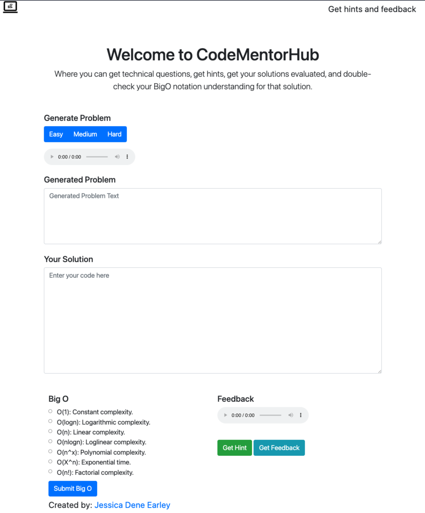
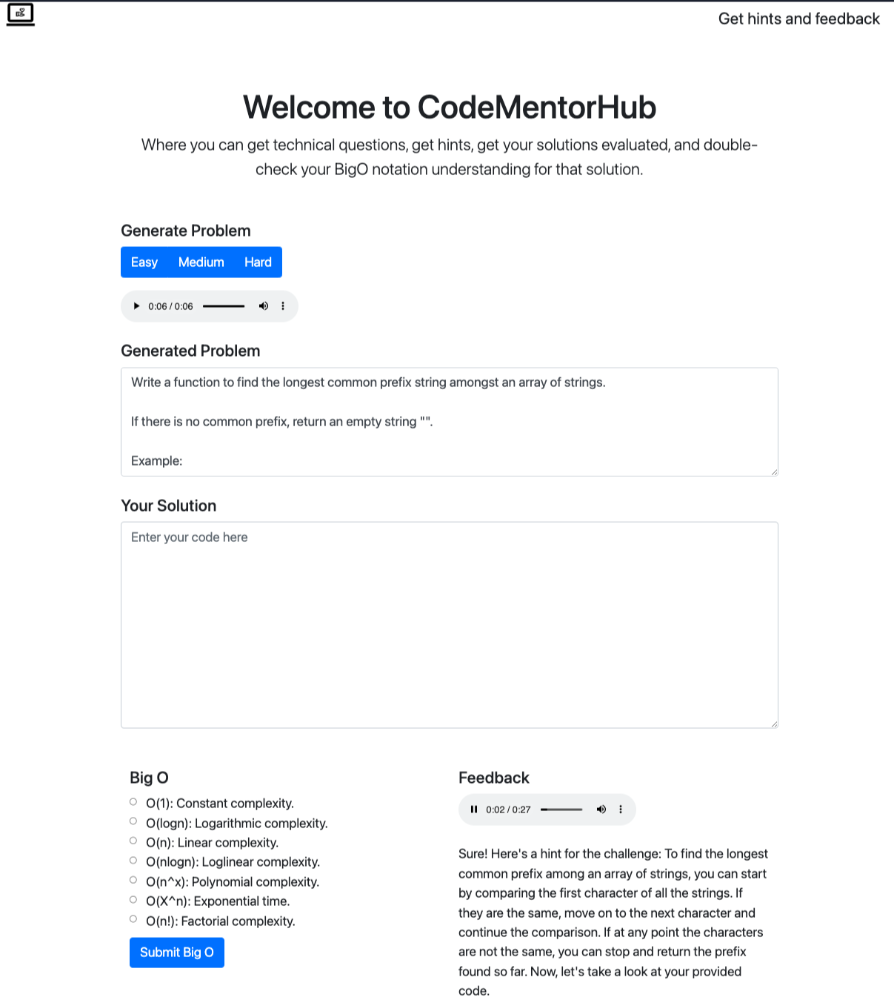

CodeMentorHub
--------

**Description**

A web app where users can get technical questions, get hints, get their solutions evaluated, and double-check thier BigO notation understanding for that solution. Users can also use their own technical questions.  

**How it works**

Users can either request problems of varying difficulty or input their own. When requesting a problem, an AJAX call is made to the Flask app, which then makes an API call to the OpenAI API for a challenge. The received text is processed to enhance clarity by removing backticks and shortening the content. This processed text is converted into an audio file (TTS) and played automatically.

Users can submit their solutions in a designated text box. At any point, they can request hints or feedback or ask to evaluate their BigO notation. This again uses AJAX calls to the Flask app, triggering API calls to OpenAI. The responses are converted into audio files, automatically played for the user.


### Screenshot

**Homepage**



**Generated question and hint**



**Generated question, ask for hint, feedback and Big O**


### Technology Stack

**Application:** Python, Flask, Jinja    
**APIs:** OpenAI  
**Front-End**: HTML/CSS, Bootstrap, JQuery, JavaScript, AJAX    


### How to run CodeMentorHub on Replit

- Go to [Replit Project](https://replit.com/@jessicawantsstu/whiteboarding-practice)
- Fork project
- Click on Run button at the top of the webite


#### How to run CodeMentorHub


Create a virtual environment 

```
> virtualenv env
> source env/bin/activate
```

Install the dependencies

```
> pip install -r requirements.txt
```

In a new Terminal run App
```
> python server.py
```


Open your browser and navigate to 

```
http://localhost:5000/
```


Note: The Agent functionality requires that you have an [OpenAI](https://platform.openai.com/api-keys) developer keys set as local environment variables:

```
OPEN_AI_KEY
```


### About the Developer    

[Jessica Dene Earley-Cha](https://jessicadeneearley-cha.com/jessica)


[Linkedin](https://www.linkedin.com/in/jessicaearley)    
